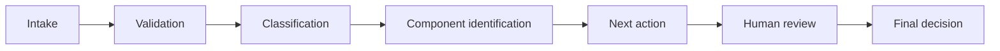

# Workflow

## Notes
- Validation blocks incomplete submissions and requests missing data.
- Human review is mandatory for ambiguous or low-confidence component matches.
- Final decision is logged for traceability and future process tuning.
